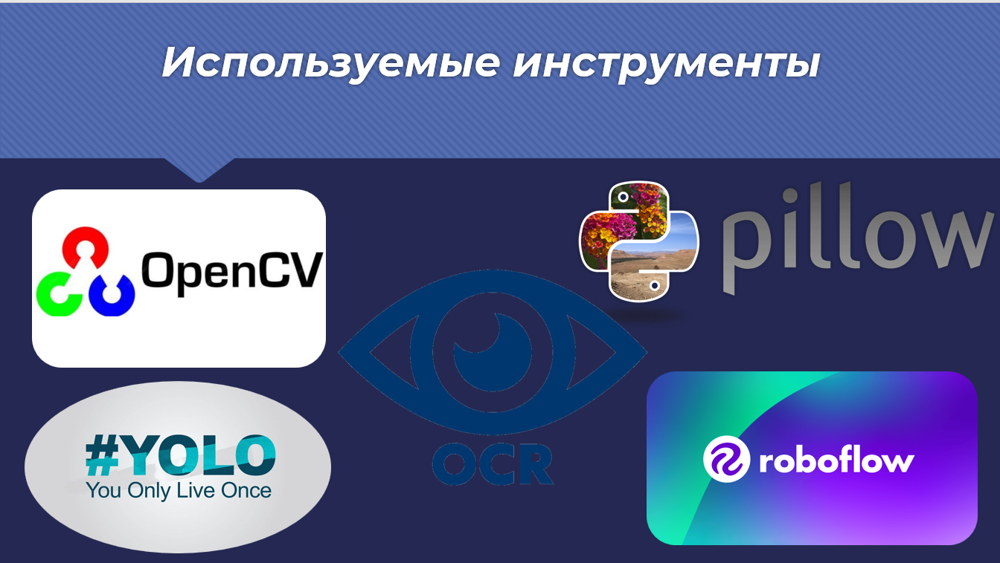
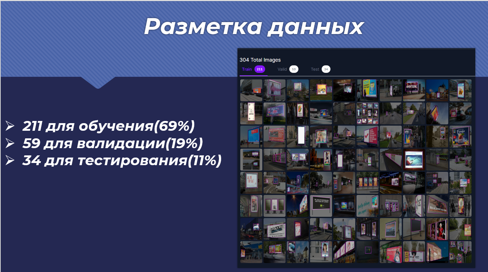
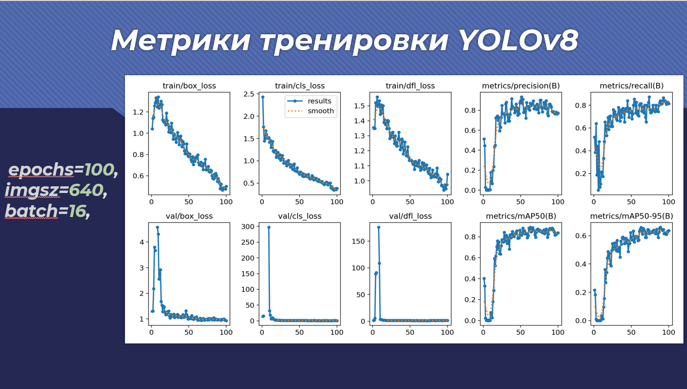
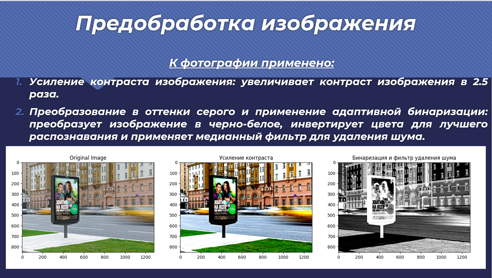
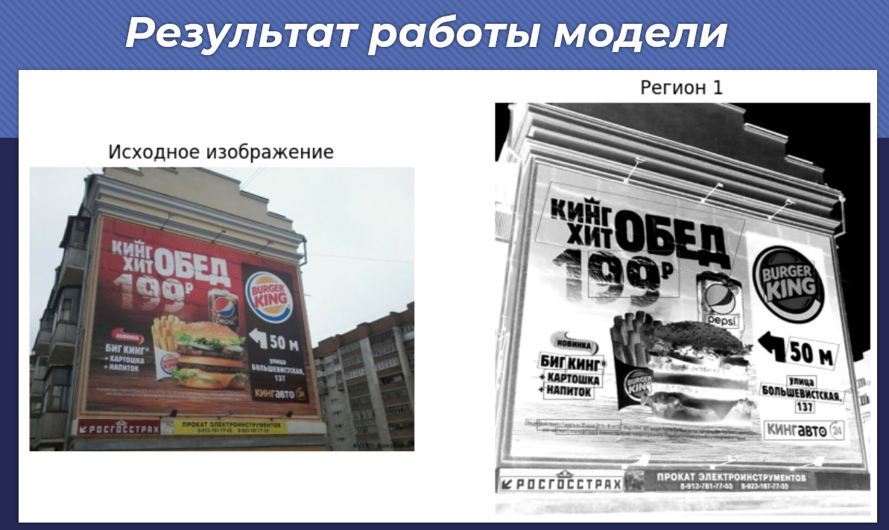
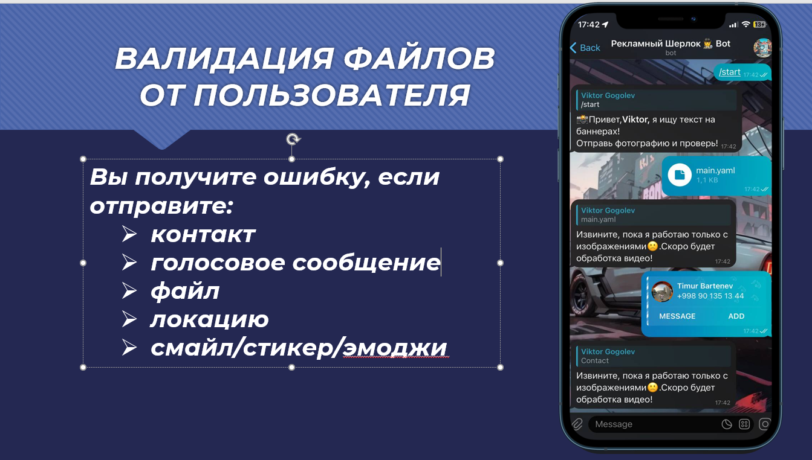
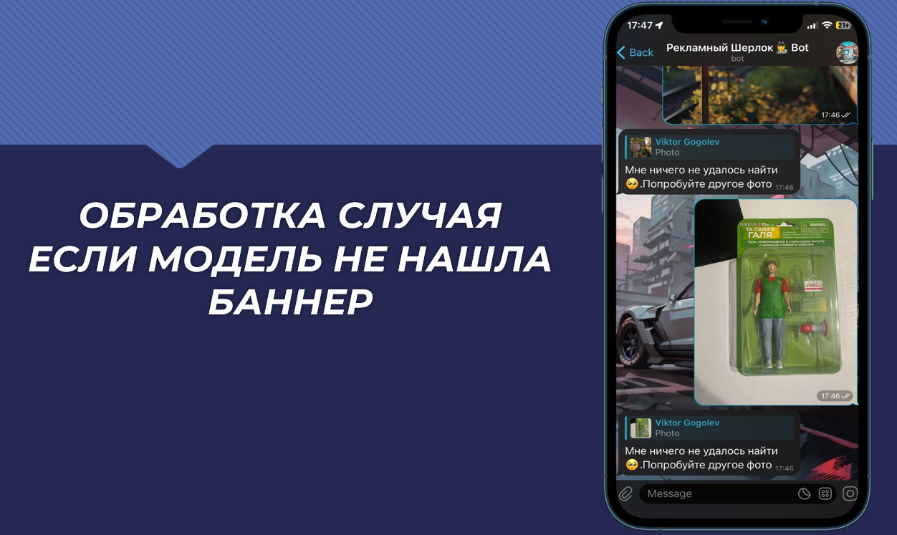
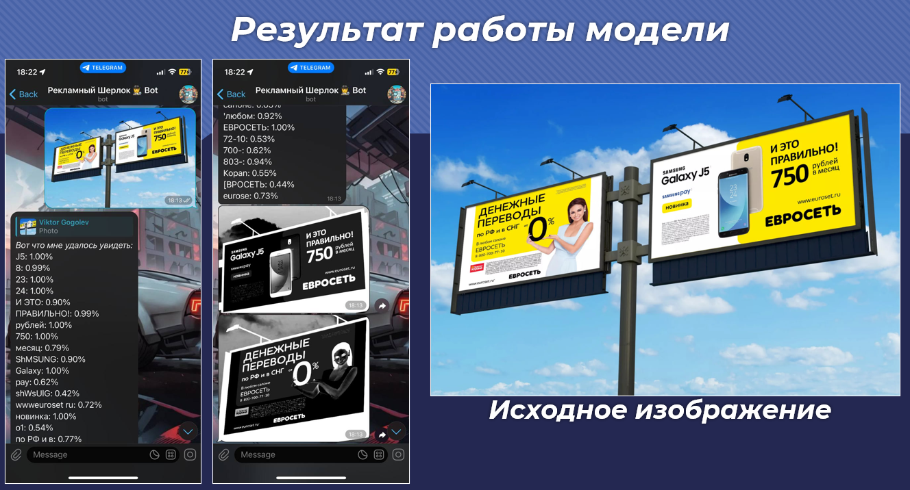

# 🕵️‍♂️ Billboard Text Detection Telegram Bot

## Описание

Этот Telegram-бот автоматически находит рекламные билборды на фотографиях и распознаёт текст на них с помощью нейросети YOLO и OCR. Просто отправьте фото — бот вернёт найденные области и распознанный текст.

---

## Краткая презентация

<p align="center">
  <!-- Примеры работы: вставьте свои изображения ниже -->
  
  
  
  
  
  
  
  
</p>

---

## Быстрый старт

### 1. Клонируйте репозиторий и установите зависимости

```bash
pip install -r requirements.txt
```

### 2. Получите токен Telegram-бота

- Перейдите в [@BotFather](https://t.me/botfather) и создайте нового бота.
- Скопируйте HTTP API Token.

### 3. Создайте файл `conf.py` в корне проекта:

```python
TOKEN = 'ВАШ_ТОКЕН_ОТ_BOTFATHER'
```

### 4. Убедитесь, что файл с весами YOLO (`best.pt`) находится в корне проекта.

### 5. Запустите бота

```bash
python bot.py
```

---

## Docker

Для запуска в Docker:

```bash
docker-compose up --build
```

---

## Пример использования

1. Отправьте фотографию с билбордом боту в Telegram.
2. Получите ответ с выделенными областями и распознанным текстом.

---

## Контакты

- Гуреев Кирилл: [Telegram](https://t.me/Valer04ka1488) | [VK](https://vk.com/abchik1488) | [GitHub](https://github.com/Abchik)
- Гоголев Виктор: [Telegram](https://t.me/victor_gogolev) | [VK](https://vk.com/victor_gogolev) | [GitHub](https://github.com/paradaise)

---

## Примечания

- Для работы OCR требуется поддержка GPU (рекомендуется CUDA).
